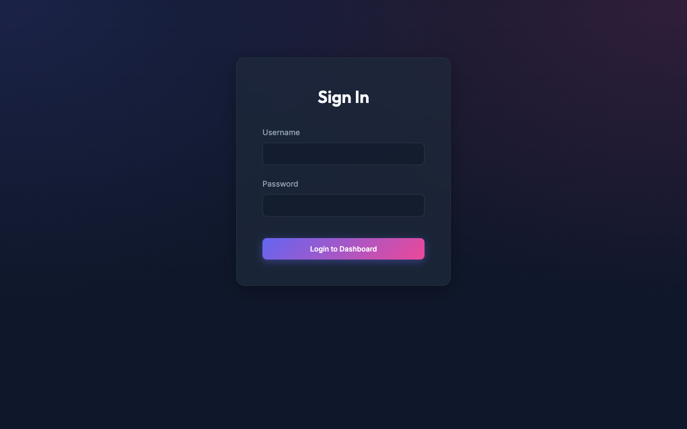
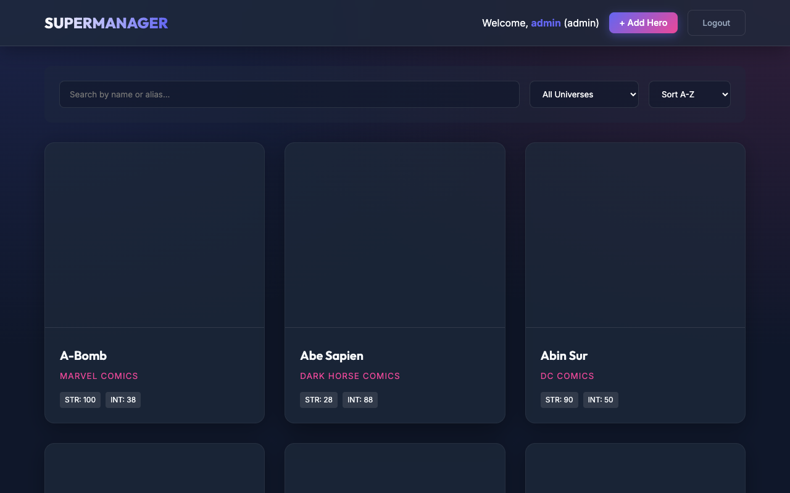
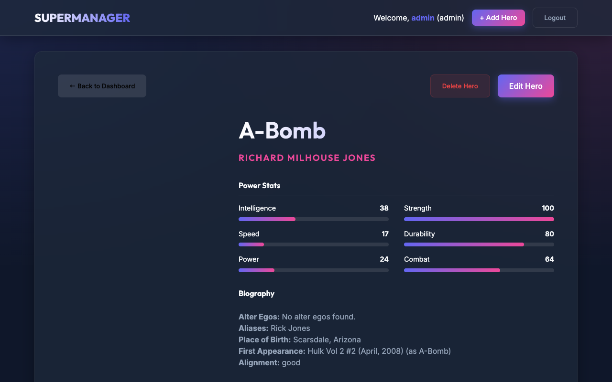

# Documentation Technique - SuperHero Manager

## 1. Liste des routes API

Le back-end (Node.js/Express) expose une API RESTful protégée. Toutes les routes relatives aux héros (à l'exception de l'authentification) nécessitent un token JWT valide dans l'en-tête de la requête (`Authorization: Bearer <token>`).

### Authentification (`/api/auth`)

| Méthode | Route | Description | Accès | Body attendu |
|:---|:---|:---|:---|:---|
| **POST** | `/api/auth/register` | Inscrire un nouvel utilisateur | Public | `{ username, password, role }` |
| **POST** | `/api/auth/login` | Connecter un utilisateur | Public | `{ username, password }` |

### Gestion des Héros (`/api/heroes`)

| Méthode | Route | Description | Accès | Body attendu |
|:---|:---|:---|:---|:---|
| **GET** | `/api/heroes` | Récupérer la liste de tous les héros (supporte les filtres/tri via query params) | Authentifié | - |
| **GET** | `/api/heroes/:id` | Récupérer les détails d'un héros spécifique par son ID | Authentifié | - |
| **POST** | `/api/heroes` | Créer un nouveau héros avec une image | Admin / Editor | `FormData` (champs + `image`) |
| **PUT** | `/api/heroes/:id` | Mettre à jour un héros existant | Admin / Editor | `FormData` (champs + `image`) |
| **DELETE**| `/api/heroes/:id` | Supprimer un héros existant | Admin uniquement | - |

---

## 2. Schéma des collections MongoDB

La base de données `superheroes` contient deux collections principales basées sur les schémas Mongoose.

### Collection : `users`
Gère les accès et les permissions de l'application.

```javascript
{
  _id: ObjectId,
  username: { type: String, required: true, unique: true },
  password: { type: String, required: true }, // Haché avec bcrypt
  role: { type: String, enum: ['admin', 'editor', 'visitor'], default: 'visitor' },
  createdAt: Date,
  updatedAt: Date
}
```

### Collection : `heroes`
Stocke les données complètes des super-héros.

```javascript
{
  _id: ObjectId,
  id: Number,
  name: { type: String, required: true },
  slug: String,
  powerstats: {
    intelligence: { type: Number, default: 0 },
    strength: { type: Number, default: 0 },
    speed: { type: Number, default: 0 },
    durability: { type: Number, default: 0 },
    power: { type: Number, default: 0 },
    combat: { type: Number, default: 0 }
  },
  appearance: {
    gender: String,
    race: String,
    height: [String],
    weight: [String],
    eyeColor: String,
    hairColor: String
  },
  biography: {
    fullName: String,
    alterEgos: String,
    aliases: [String],
    placeOfBirth: String,
    firstAppearance: String,
    publisher: String, // Univers (Marvel, DC, etc.)
    alignment: String
  },
  work: {
    occupation: String,
    base: String
  },
  connections: {
    groupAffiliation: String,
    relatives: String
  },
  images: {
    xs: String,
    sm: String,
    md: String,
    lg: String
  },
  customImage: String, // Chemin de l'image uploadée via Multer (/uploads/...)
  createdAt: Date,
  updatedAt: Date
}
```

---

## 3. Captures d'écran des interfaces

*(Note : Pour le rendu final de votre document, veuillez remplacer ces textes par vos propres captures d'écran de l'application lancée sur votre ordinateur).*

* **Page de connexion (`/login`)** :
  

* **Tableau de bord - Liste des héros et filtres (`/`)** :
  

* **Page de détail d'un héros (`/hero/:id`)** :
  

* **Formulaire d'ajout / modification (`/add-hero`)** :
  
